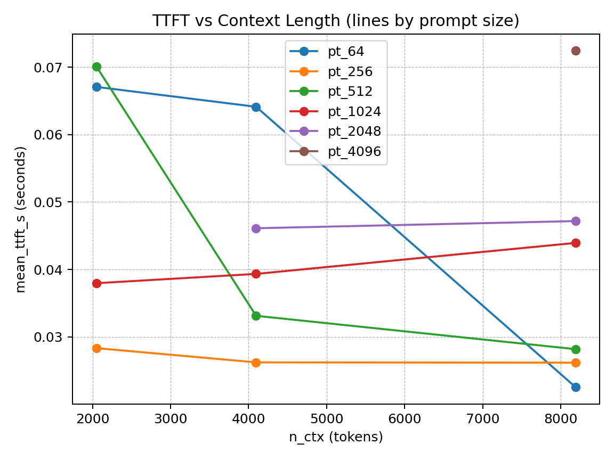
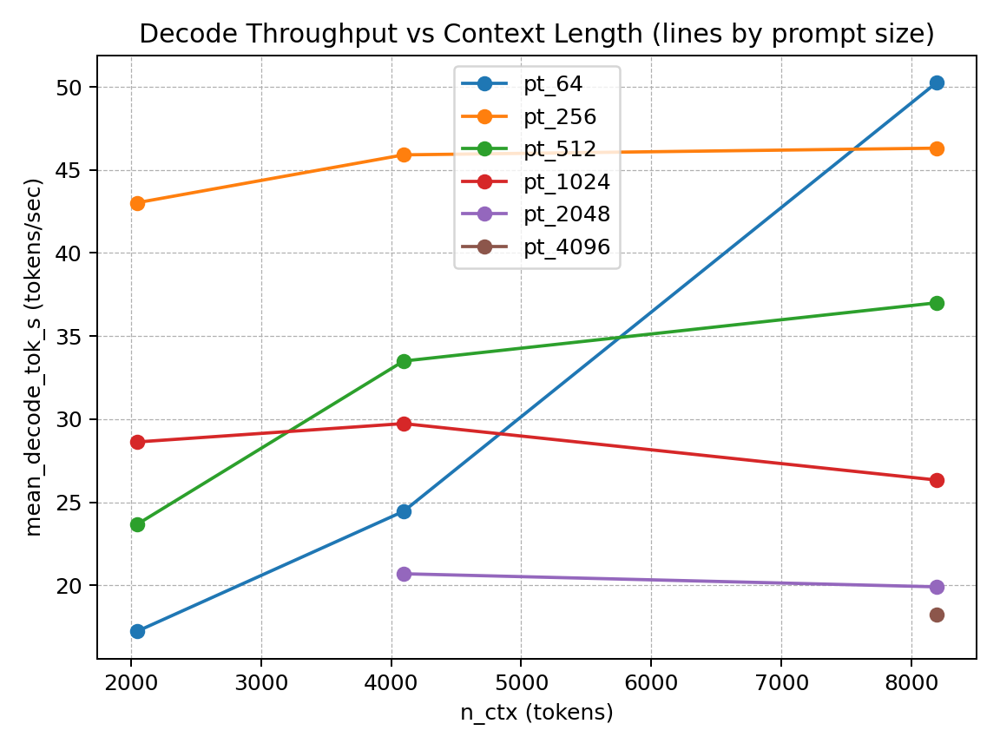
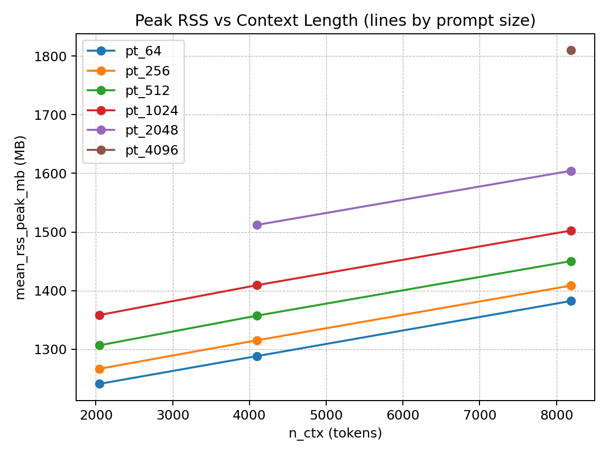

# GreenAttentionBench

GreenAttentionBench is a lightweight benchmarking suite for **long-context LLM inference** on consumer hardware.  
It focuses on *practical systems metrics* rather than model quality.

The goal is simple: understand how **context length** and **prompt size** affect
latency, throughput, and memory during inference.

---

## What it measures

For a given model, prompt size, and context window:

- **TTFT (Time-to-First-Token)**
- **Decode throughput (tokens/sec)**
- **Peak memory usage (RSS)**
- Warm vs cold inference behavior

Results are aggregated into a single CSV and plotted automatically.

---

## How it works

- Uses `llama.cpp` via `llama-cpp-python`
- Runs controlled matrix sweeps over:
  - prompt size
  - context length
  - inference mode
- Appends one summary row per condition to `results_summary.csv`
- Generates plots for quick inspection

---

## Key findings

- **Peak memory scales linearly with context length**, consistent with KV-cache growth
- **TTFT is not strictly monotonic**: small prompts can see lower TTFT at larger contexts due to allocator and cache effects
- **Decode throughput decreases for large prompts** as context grows, revealing a clear latency–memory–throughput tradeoff
- Long-context inference on consumer CPUs is feasible, but quickly becomes memory-bound

These results reflect runtime behavior.

---

## Why this exists

Most LLM benchmarks focus on accuracy or GPU performance.  
This project focuses on **systems behavior**:

What actually happens when you push long contexts on real hardware?

## Plots

### Time to First Token vs Context Length

### Decode Throughput vs Context Length

### Peak Memory vs Context Length

